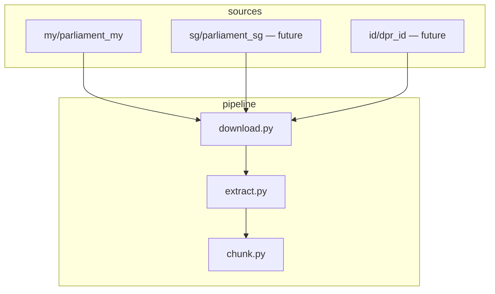
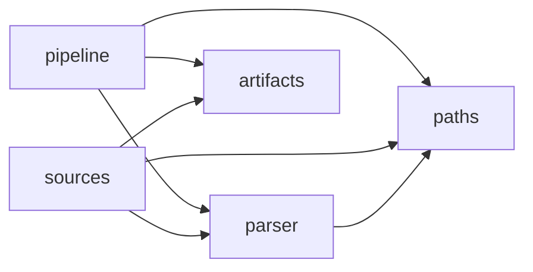

# Architecture

## Design decisions

### 1. Source plugin pattern

Each country/chamber is a self-contained adapter under `src/lib/sources/<region>/<adapter>/`.
The adapter owns everything about that source: how to discover URLs, how to fetch pages,
how to parse the HTML or XML, and what the output schema looks like.

No shared crawl logic bleeds across adapters. If parlimen.gov.my changes its format,
only `parliament_my/` changes.



### 2. Artifact-first, no DB in the library

parawl writes files, not database rows. Every output is a file on disk with a deterministic path:

```
data/raw/<adapter>/pdf/<year>/<bill_id>.pdf
data/derived/<adapter>/extracted/<year>/<bill_id>.md
```

**Why:** any downstream app (SQLite, Postgres, vector store, S3) can consume files.
A DB dependency would couple parawl to one storage choice and make local runs harder.
The application layer (stateconscious) owns the DB.

### 3. Content-addressed storage

`artifacts.py` computes SHA-256 of each downloaded file and stores it in a `.meta.json` sidecar.
The path itself uses the bill's natural key (`year/bill_id`), not the hash.

**Why:** the natural key makes paths human-readable and debuggable.
The hash in `.meta.json` enables change detection — if a PDF is silently re-published,
the SHA-256 changes and downstream stages can detect it.

### 4. Idempotent stages

Each pipeline stage checks whether its output artifact exists before running.
Re-running the pipeline on a machine that already has most bills does not re-download or re-extract them.

Pass `--force` to any stage to overwrite existing artifacts.

### 5. Import direction

Cross-module imports flow in one direction only:



`pipeline` never imports from `sources`. `sources` never imports from `pipeline`.
This keeps stages independently testable.

---

## Repository layout

| Path | Role |
|------|------|
| `src/lib/paths.py` | `repo_root()` — single source of truth for all path math |
| `src/lib/artifacts.py` | Content-addressed paths under `data/raw` and `data/derived` |
| `src/lib/sources/` | One adapter per legal source, one folder per region |
| `src/lib/parser/` | Shared parsers used by multiple adapters |
| `src/lib/pipeline/` | Processing stages: download → extract → chunk → analyze |
| `data/raw/` | Downloaded PDFs + `.meta.json` sidecars (gitignored) |
| `data/derived/` | Extracted Markdown, chunks, analysis JSON (gitignored) |
| `tests/` | Pytest — unit tests for parsers, adapters, pipeline stages |
| `docs/` | This MkDocs site |

---

## Adding a new source

1. Create `src/lib/sources/<region>/<adapter>/`
2. Add `seed_urls.txt` — one URL per line, the entry points for the crawl
3. Implement `fetch.py`, `parse.py`, `crawl.py`, `config.py`
4. Add tests under `tests/`
5. Document under `docs/sources/<region>/<adapter>.md`

See `src/lib/sources/my/parliament_my/` as the reference implementation.
