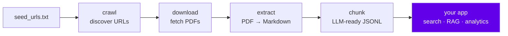

# parawl

**Southeast Asia parliamentary document crawler and parser library.**

Crawl, download, and extract bill and Hansard text from public government sources.
No hosted service required — run it locally, own your corpus.

---

## What it does



Each stage is a standalone Python module. You can run one stage, all stages, or wire them into your own pipeline.
parawl has no opinion on where data goes after extraction.

---

## Directory structure

```
parawl/
│
├── src/lib/
│   ├── paths.py            repo_root() — single source of truth for all paths
│   ├── artifacts.py        content-addressed path helpers (data/raw, data/derived)
│   │
│   ├── sources/            one adapter per legal source
│   │   ├── discovery.py    seed_urls.txt → source list
│   │   └── my/
│   │       └── parliament_my/   parlimen.gov.my bills (1990–present)
│   │           ├── crawl.py
│   │           ├── fetch.py
│   │           ├── parse.py
│   │           ├── dhtmlx_arkib.py
│   │           ├── pdf_discovery.py
│   │           ├── config.py
│   │           └── seed_urls.txt
│   │
│   ├── parser/             shared parsers used across adapters
│   │   └── seed_txt.py
│   │
│   └── pipeline/           processing stages
│       ├── extract.py      ✅ PDF → Markdown
│       ├── download.py     🔧 planned
│       └── chunk.py        🔧 planned
│
├── data/                   gitignored — produced at runtime
│   ├── raw/                PDFs + .meta.json sidecar
│   └── derived/            extracted Markdown, chunks, analysis
│
├── tests/
├── docs/                   this site
└── mkdocs.yml
```

---

## Output artifacts

A run produces content-addressed artifacts under `data/`:

```
data/raw/my/parliament_my/pdf/2024/
  DR-6-2024.pdf
  DR-6-2024.meta.json      # sha256, url, outcome, downloaded_at

data/derived/my/parliament_my/extracted/2024/
  DR-6-2024.md             # full bill text in Markdown
```

---

## Quickstart

=== "Windows"

    ```powershell
    git clone https://github.com/q3dresearch/parawl
    cd parawl
    python -m venv .venv
    .venv\Scripts\Activate.ps1
    pip install -r requirements.txt
    ```

=== "macOS / Linux"

    ```bash
    git clone https://github.com/q3dresearch/parawl
    cd parawl
    python3 -m venv .venv
    source .venv/bin/activate
    pip install -r requirements.txt
    ```

Then run a crawl:

```bash
# Crawl bill index — produces src/out/bills_csv/bills_<year>.csv
PYTHONPATH=src python -m lib.sources.my.parliament_my.crawl --list-arkib-bills --arkib-csv-dir src/out/bills_csv

# Extract text from downloaded PDFs
PYTHONPATH=src python -m lib.pipeline.extract
```

---

## Browse these docs locally

```bash
pip install mkdocs-material
mkdocs serve
# open http://127.0.0.1:8000
```

---

## Part of the StateConscious project

`parawl` is the open data layer of [StateConscious](https://github.com/q3dresearch/stateconscious) —
a longitudinal study on Southeast Asian law and legislative transparency.

The application layer (search, RAG indexing, analytics, frontend) lives in stateconscious and consumes parawl's artifacts.
parawl is the part anyone can run independently.
