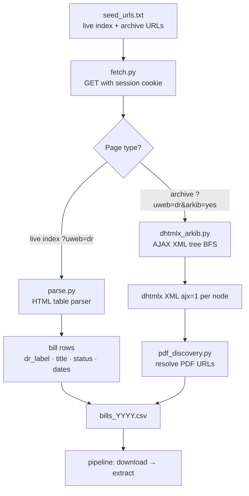
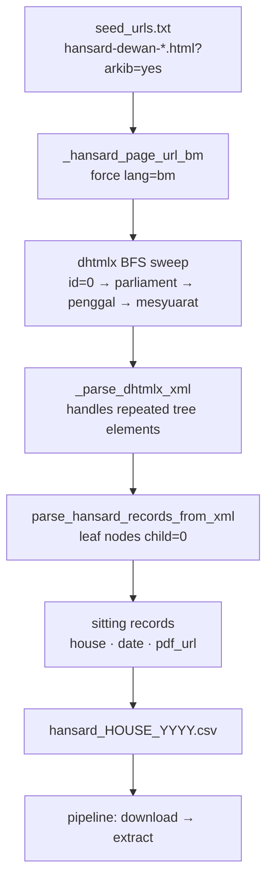

# Malaysia — Parliament

**Adapter ID:** `parliament_my`  
**Country:** Malaysia (`my`)  
**State:** Federal  
**Source:** `https://www.parlimen.gov.my`

This adapter covers two document types from Parliament Malaysia: **Bills** (Rang Undang-Undang) and **Hansard** (Penyata Rasmi).

---

## Bills (Rang Undang-Undang)

**Houses:** Dewan Rakyat (DR) · Dewan Negara (DN)  
**Coverage:** 1990 – present

Each bill record includes:

| Field | Description |
|-------|-------------|
| `dr_label` | Bill reference number (e.g. `D.R.21/2024`) |
| `summary` | Title and pass status |
| `first_reading` | Date tabled |
| `second_reading` | Date debated |
| `passed_at` | Date passed (if passed) |
| `presented_by` | Minister who tabled the bill |
| `pdf_url` | Direct link to the bill PDF on parlimen.gov.my |

### Crawl strategy



**Live index** (`?uweb=dr`) — standard HTML table, parsed by `parse.py`.

**Archive** (`?uweb=dr&arkib=yes`) — uses a **dhtmlx tree** served over AJAX. `dhtmlx_arkib.py` does a BFS sweep node-by-node and extracts structured bill rows, then `pdf_discovery.py` resolves PDF URLs.

Historical bills (pre-~2010) may have missing or broken PDF URLs; `pdf_resolve_status` records whether the link was confirmed reachable.

### Coverage

| Period | Bill count (approx.) |
|--------|----------------------|
| 1990–2009 | ~700 |
| 2010–2019 | ~280 |
| 2020–2024 | ~100 |
| **Total** | **~1,100** |

### CLI

```bash
# List all bills (JSON to stdout)
PYTHONPATH=src python -m lib.sources.my.parliament_my.crawl --list-arkib-bills

# Write per-year CSVs
PYTHONPATH=src python -m lib.sources.my.parliament_my.crawl \
  --list-arkib-bills --arkib-csv-dir src/out/bills_csv

# Resolve PDF URLs (probes each URL in parallel)
PYTHONPATH=src python -m lib.sources.my.parliament_my.crawl \
  --list-arkib-bills --arkib-resolve-pdfs
```

---

## Hansard (Penyata Rasmi)

**Houses:** Dewan Rakyat (DR) · Dewan Negara (DN)  
**Coverage:** Parliament 1 (1959) – present  
**Language:** Bahasa Malaysia only — the site has no English Hansard

Each sitting record includes:

| Field | Description |
|-------|-------------|
| `house` | `DR` or `DN` |
| `sitting_date` | ISO date of the sitting (e.g. `2024-03-11`) |
| `sitting_date_text` | Original Malay date text (e.g. `11 Mac 2024`) |
| `parliament_no` | Parliament number (1–15+) |
| `penggal_no` | Session (penggal) number within the parliament |
| `mesyuarat_no` | Meeting (mesyuarat) number within the session |
| `mesyuarat_text` | Label of the meeting node from the tree |
| `pdf_filename` | Canonical filename (e.g. `DN-19071982.pdf`) |
| `pdf_url` | Direct link to the Hansard PDF |

### Crawl strategy



The Hansard dhtmlx tree has **4 levels**: parliament → penggal (session) → mesyuarat (meeting) → sitting dates (leaf nodes). The root `id=0` only returns Parliaments 1–6; Parliaments 7–15 must be seeded explicitly as `0_7`, `0_8`, etc. — the BFS handles this automatically.

Leaf nodes carry `loadResult('/files/hindex/pdf/DR-DDMMYYYY.pdf')` in their `myurl` userdata. Dates are parsed from Malay month names (`Julai` → `07`) or extracted from the filename pattern.

### Parliament year mapping

| Parliament | Years |
|-----------|-------|
| 1 | 1959–1964 |
| 2 | 1964–1969 |
| 3–6 | 1971–1986 |
| 7–14 | 1986–2022 |
| **15** | **2022–present** |

### CLI

```bash
# Full Hansard sweep — all parliaments (slow, ~8000 nodes)
PYTHONPATH=src python -m lib.sources.my.parliament_my.crawl --list-hansard

# Fast path — only Parliament 15 (2022–present)
PYTHONPATH=src python -m lib.sources.my.parliament_my.crawl \
  --list-hansard --hansard-parliament 15

# Filter by year (also scopes BFS to relevant parliament)
PYTHONPATH=src python -m lib.sources.my.parliament_my.crawl \
  --list-hansard --hansard-year 2024

# Write one CSV per house+year
PYTHONPATH=src python -m lib.sources.my.parliament_my.crawl \
  --list-hansard --hansard-parliament 15 --hansard-csv-dir src/out/hansard_csv

# Write a single combined CSV
PYTHONPATH=src python -m lib.sources.my.parliament_my.crawl \
  --list-hansard --hansard-parliament 15 --hansard-csv src/out/hansard_all.csv
```

---

## Known quirks (both document types)

- **TLS issues:** some clients see certificate verification failures; use `--insecure` as a dev bypass.
- **Soft-200 errors:** the site sometimes returns HTTP 200 with an HTML error page. Detected by `error_pages.py`; logged as `outcome=soft_200`.
- **Session / language cookie required:** direct PDF URLs return `"File does not exist (3)"` without a valid session. Workaround: visit `parlimen.gov.my` in a browser, copy session cookies from DevTools, store as `PARLIMEN_COOKIE` in `.env`.
- **Hansard is BM-only:** the `lang=bm` parameter is forced on all Hansard requests — the English tab does not exist for this content type.
- **Missing 2003 bills:** no bills for 2003 in the archive; appears to be a gap in the site's own data.
- **Repeated `<tree>` elements:** the Hansard endpoint occasionally returns multiple concatenated XML `<tree>` blocks. `_parse_dhtmlx_xml` wraps these in a synthetic root before parsing.

## What's not covered

- **Consolidated Acts:** this adapter captures bills as tabled, not the consolidated version post-amendment. Consolidated text lives on `agc.gov.my` — a separate future adapter.
- **Questions & Answers (Perbahasan):** oral and written parliamentary questions are not currently crawled.
- **Committee reports:** committee proceedings are a separate section of the site, not yet added.
